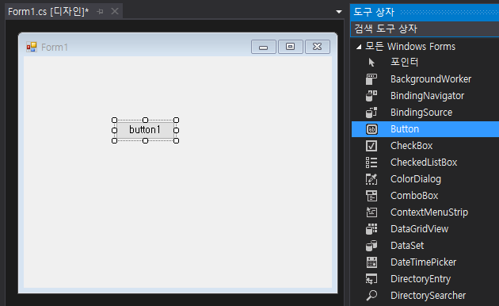
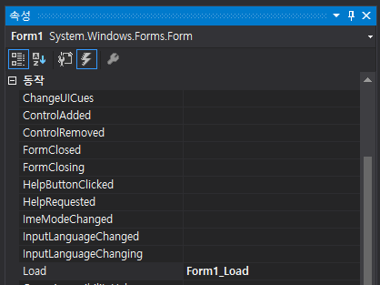
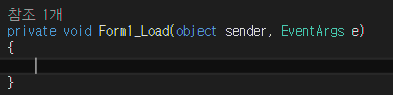
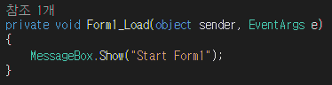

## C# WinForm Study01 - 기본생성파일 / Form Designer / Form의 시작과 종료

### *기본 생성 파일*

> #### Program.cs
>
> - *<u>**WinForm의 주 진입점**</u>*
> - Application.Run() : Form이라는 Window 창 객체를 화면에 출력하고 그 창에서 작동되는 마우스나 키보드의 동작을 모두 읽어와 출력해주는 역할
>
> #### Form1.Designer.cs
>
> - 만드려는 ***<u>WindowForm의 미리보기 형식</u>***으로 Button, Label  등의 Control을 설정하고 구축
>
> #### Form1.cs
>
> - Form1.Designer.cs에서 만든 ***<u>Control을 실제로 다루는 C# 소스코드</u>*** 작성
> - Dispose(bool disposing) : 관리되는 리소스를 삭제해야 하면 true, 그렇지 않다면 false
> - InitializeComponent() : UI를 생성, 디자이너 지원에 필요한 메서드로 수정X
> - public partial class Form1 : Form 이란?  
>   -  Form1.cs와 Form1.Designer.cs는 똑같은 클래스인데 2개의 cs 파일로 나눠버린 것으로 **public class** 라고 선언하지 않고 나누어 떨어진 class라는 의미의 **public partial class Form1 : Form** 으로 선언하여 사용

### FormDesigner

> Visual Studio에서 유용한 Form Designer 제공
>
> 코드를 통해 Form 위에 Control을 배치하고 Property 변경하던 작업이 화면에서 마우스 클릭만으로 가능
>
> "**<u>*Windows Forms 응용 프로그램*</u>**'' 으로 프로젝트 생성하여 사용
>
> 
>
> #### WinForm UI 구성
>
> > **<u>1) ToolBox에서 원하는 Control(Button, CheckBox 등...)을 Drag&Drop으로 배치</u>**
> >
> > 
> >
> > **<u>2) Event 처리기 등록</u>**
> >
> > - Control을 선택한 생태에서  속성창(PropertyWindow)의 번개버튼을 누를 경우 Event등록 가능
> >
> >   
> >
> > - 원하는 Event 더블클릭 시 함수 자동 생성
> >
> >   
> >
> > 
> >
> > **<u>3) 구현할 코드를 추가하여 Event처리기 완성</u>**
> >
> > 

### Form의 시작과 종료

>Form 및 Control 클래스는 응용 프로그램 시작 및 종료와 관련된 메소드를 제공
>
>#### Form의 시작
>
>Form.Load
>
>- Form이 로드되어 메모리에 올라올 때, 화면에 표시되기 직전에 발생.
>
>- Property를 변경한다거나, 리소스를 할당하는등 Form의 동작에 필요한 초기화 수행
>
>- Form의 생애 동안 **<u>딱 한번 발생</u>**하므로 일회적인 초기화에 적합.
>
>- From.Load 이벤트보다 Form 클래스의 생성자가 먼저 호출
>
>
>
>#### Form의 종료
>
>1) Form.Closing
>
>- Form이 닫히기 직전에 발생.
>
>- FormClosingEventArgs 객체가 전달, 이 객체의 Cancel Property를 true로 설정시 종료 취소 가능
>
>2) Form.Closed
>
>- Form이 닫힐 때, 파괴될 때 발생.
>- Form.Load 이벤트에 반대되는 이벤트로 Form의 생애 딱 한번만 전달
>- Form.Load 에서 할당한 리소스를 이 이벤트에서 해제
>- 별도의 인수는 전달 X
>
>3) Application 클래스의 ApplicationExit 이벤트는 기본 Form의 종료 이벤트 이후에 발생
>
>4) Constructor(생성자) : 언어 차원에서 컴파일러가 자동으로 호출하는 메소드
>
>- 호출 순서: Constructor→ Load Event
>- 객체를 초기화하는 시점을 제공
>- 초기화 작업만 진행해야하며 Form을 닫아 버리는 동작X(예외 발생)
>
>5) Load Event : 라이브러리 차원에서 프레임워크에 의해 호출되는 메소드