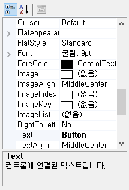

## C# WinForm Study02 - Control

### Control

> #### Control이란?
>
> - 윈도우 운영체제가 제공하는 사용자 인터페이스 요소
> - 응용 프로그램을 제어하는 데 사용하는 도구라는 의미에서 붙여진 이름
> - Label, Button, TextBox, ComboBox 등이 Control
>
> 
>
> #### Control 생성 방법
>
> **<u>1) Control Instance 생성</u>**
>
> - WinForm의 모든 컨트롤은 System.Windows.Forms.Control을 상속
>
> - ```
>   Button button = new Button();
>   Control con = new Button(); 형태로도 사용할 수 있음
>   ```
>
> **<u>2)  Control의 Property 값 지정</u>**
>
> - 컨트롤의 모양, 속성값을 지정
>
> - ```
>   button.Text = "button!!!";
>   button.Left = 100;
>   button.Top = 200;
>   ```
>
> **<u>3)  Control의 EventHandler 지정</u>**
>
> - Event가 발생했을 때 어떤 명령들을 실행할 지를 지정
>
> - ```
>   button.Click += (object sender, EventArgs e) =>
>   {
>       MessageBox.Show("BBUUTTTTOONN!");
>   };
>   
>   button.MouseDown += 
>     new System.Windows.Forms.MouseEventHandler(this.button_MouseDown);
>   ```
>
> **<u>4)  Form에 Control 추가</u>**  
>
> - ```
>   form.Controls.Add(button);
>   ```
>
> 
>
>  #### Control 예제
>
>       using System;
>     using System.Windows.Forms;
>     
>     namespace SimpleWindow
>     {
>         internal class MainApp : Form
>         {
>             static int Main(string[] args)
>             {
>                 Button button = new Button();
>     
>                 button.Text = "click me!";
>                 button.Left = 100;
>                 button.Top = 50;
>     
>                 button.Click += (object sender, EventArgs e) =>
>                 {
>                     MessageBox.Show("clicked!");
>                 };
>     
>                 MainApp form = new MainApp();
>                 form.Text = "Form & Control";
>                 form.Height = 150;
>     
>                 form.Controls.Add(button);
>     
>                 Application.Run(form);
>     
>                 return 0;
>             }
>         }
>     }


#### 참고 Control

>**propertyGrid**
>
>- 속성창을 만들어 주는 Control
>
>- Visual Studio의 속성 창과 비슷한 속성창을 구현할 수 있다.
>
>  private void toolClick(object sender, EventArgs e)
>  {
>         Control obj = sender as Control;
>         propertyGrid.SelectedObject = obj;
>  }
>
>- SelectedObject에 Control을 넣으면 해당 컨트롤의 속성을 전부 읽어오고 변경 또한 할 수 있다.
>
>

