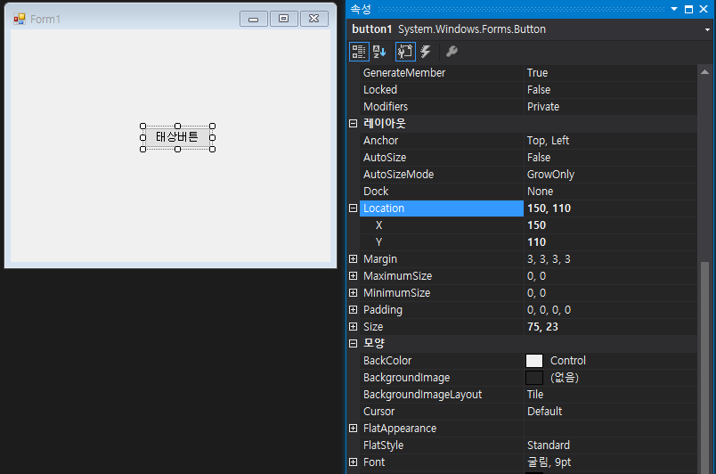
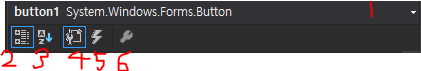

## C# WinForm Study03 - Control Property

> #### Properties
>
> Windows Forms 응용 프로그램을 만들 때 Form 이나 Control의 속성을 설정하거나 가져올 수 있음
>
> Visual Studio에서는 속성 창을 통해 쉽게 편집이 가능하다.
>
> 코드 상에서 속성 변경 관련 코드를 작성할 수도 있다.

<hr></hr>

>#### Visual Studio 속성 창으로 속성 값 변경
>
>
>
>원하는 Control를 선택하여 속성창에서 Control의 속성 값을 알 수 있고 변경할 수 있다.
>
>
>
>속성 창에서 **원하는 Control을 선택(1)**할 수 있고 **항목별(2)**, **알파벳 순(3)**으로 배치할 수 있다
>
>**속성(4)**, **이벤트 핸들러(5)**, **속성페이지(6)**를 편집 가능

<hr></hr>

> #### Form.cs 코드상에서 속성 변경 방법
>
> 원하는 컨트롤의 이름 뒤에 .을 붙이고 속성을 불러 값을 지정해준다.
>
> ```
> textBox1.MaxLength = 10;
> textBox1.ReadOnly = true;
> textBox1.PasswordChar = '*';
> ```

<hr></hr>

>#### 기본 Form  속성
>
>1. **Text 속성**
>
>- 폼에 나타나는 글자, 윈도우의 타이틀바의 텍스트를 지정
>
>2. **MaximizeBox와 MinimizeBox 속성**
>
>- 폼의 최대화, 최소화 버튼의 활성화 유무 설정
>
>3. **FormBorderStyle**
>
>- 폼의 테두리 스타일 설정
>- 속성
>  - None : 테두리가 없고, 최소화, 최대화, 종료 버튼등을 갖지 않는다
>  - FixdSingle : 고정된 단일 선 테두리를 갖는다
>  - Fixed3D : 고정된 3차원 테두리를 갖는다
>  - FixeDialog : 대화상자 스타일의 고정된 굵은 테두리를 갖는다
>  - FixedToolWindow : 고정된 도구 모음 스타일로서 오직 종료 버튼만 갖는다
>  - SizeableToolWindow : 도구 모음 스타일이지만 크기 변경할 수 있다
>
>4. **ControlBox 속성**
>
>- 윈도우 좌측 상단의 메뉴 아이콘을 클릭시, 메뉴가 나타날지 여부 결정
>
>- 값 : True, False 선택
>
>5. **StartPosition 속성**
>
>- 폼의 초기(시작) 위치 설정
>
>- Location 과 size 등과 위치 값이 틀릴경우 가장 높은 우선권을 같는 컨트롤러이다
>- 속성
>  - Manual - Location : 속성에서 지정한 위치에 나타남(X좌표, Y좌표 값)
>  - CenterScreen : 화면 중앙에 나타나게 한다
>  - WindowsDefaultBounds : 운영체제가 지정하는 기본 위치와 크기로 나타난다
>  - CenterParent : 현재 폼이 MDI폼의 자식 폼일경우, 부모 폼의 중앙에 나타난다
>
>6. **BackColor과 BackgroundImage 속성**
>
>- BackColor : 폼의 배경 색상 설정
>
>- BackgroundImage : 폼의 배경이미지 설정
>
>7. **AutoScroll 속성**
>
>- 폼의 크기가 벗어나는 컨트롤이 있는 경우 자동으로 폼에 스크롤바가 나타난다
>
>- 기본값은 False
>
>8. **Icon 속성**
>
>- 최소화할때의 아이콘 모양을 나타낸다(실행시에는 죄측 상단 아이콘)
>
>- 아래 경로에 비주얼 스튜디오의 기본적인 아이콘을 제공
> - C:/Program Files/Micro Visual Studio.NET/Common7/Graphics/icons
>
>9. **Anchr**
>
>- 컨트롤의 간격유지
>
>- 컨트롤의 크기가 변경 되더라도 일정 간격을 유지 시킨다
>
>10. **Dock 속성**
>
>- 폼의 어느 방향으로 붙이게 할지 여부를 결정
>
>- 이때 방향을 지정하게되면 폼에 꽉찬 모양이된다
>
>11. **Opacity**
>
>- 폼의 투명도를 지정하며 최대값은 1이다
>
>- 표현할때 100으로 설정하였다면 0.01단위로 코딩해야 한다.
>
>


