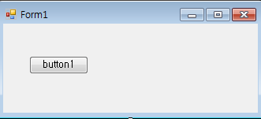
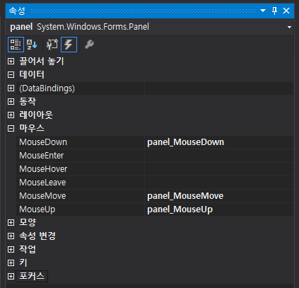
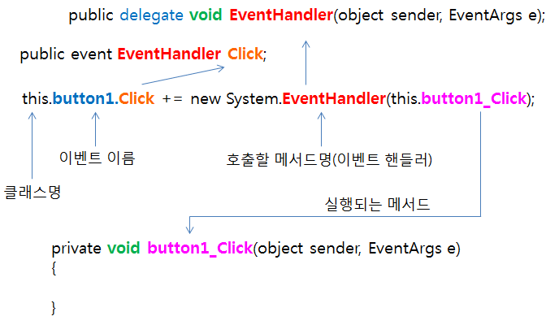
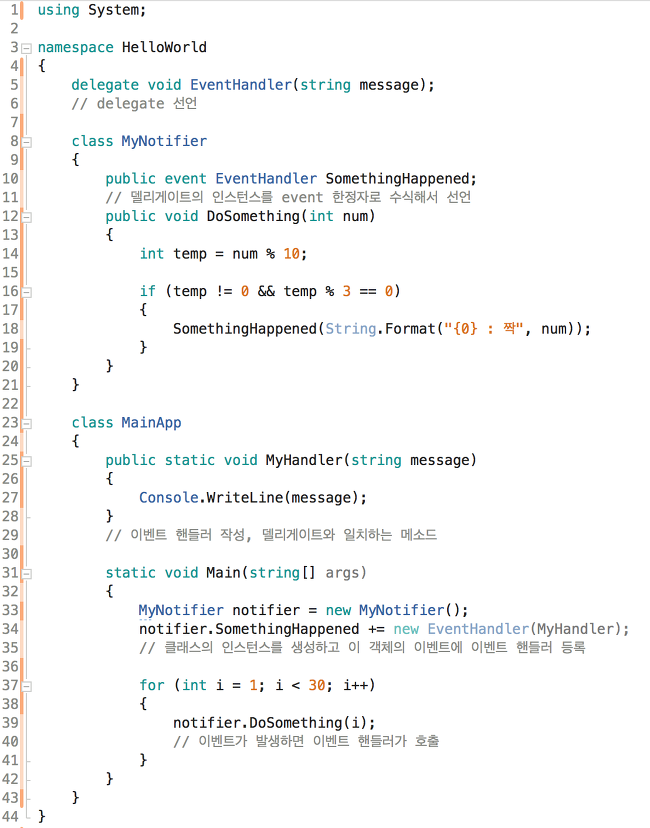
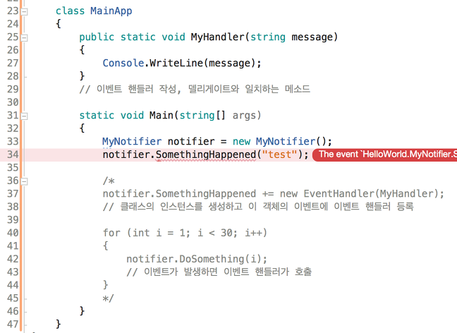

## C# WinForm Study05 - Event & delegate

#### Event? delegate?

> **<u>Event?</u>**
>
> - Class 내 특정 상황(Event)이 일어났을을 외부의 subscriber(이벤트 가입자)들에게 알려주는 것
> - Event는 delegate를 event 한정자로 수식해서 생성
>
> **<u>Event Handler?</u>**
>
> - Event에 가입한 외부 subscriber는 Event 발생 시 어떤 명령들을 실행할지 정해주는 것
> - += 연산자를 사용하여 EventHandler 추가
> - -= 연산자를 사용하여  EventHandler 삭제
>
> **<u>delegate?</u>**
>
> - 메소드를 대신해서 호출하는 역할(메소드의 대리인)
>
> <u>**Event와 delegate의 가장 큰 차이점**</u>
>
> - Event선언되어 있는 클래스 외부에서는 호출이 불가능
> - delegate는 public이나 internal로 수식되어 있으면 클래스 외부에서라도 얼마든지 호출 가능


#### WinForm Event 등록

>
>
>
>
>**<u>Control이나 속성 창에서 원하는 이벤트를 더블클릭 시 Form1.cs, Form1.Designer.cs에 코드 자동 생성</u>**
>
>- Form1.cs
>
>```
>private void button1_Click(object sender, EventArgs e)
>{
>
>}
>```
>
>- Form1.Designer.cs
>
>```
>this.button1.Click += new System.EventHandler(this.button1_Click)
>```
>
>
>
>**<u>정의 파킹(Alt + F12)를 통해 연결된 정의 도식화</u>**
>
>
>
>- 기본 클래스 라이브러리에 존재하는 미리 정의된 delegate 타입을 사용하고 있음


#### 사용자 정의 이벤트 생성

>**<u>이벤트 생성 순서</u>**
>
>1. delegate 선언
>2. 선언한 delegate 인스턴스를 event 한정자로 수식해서 선언(class 내부)
>3. EventHandler 작성(선언한 delegate 일치하는 메소드)
>4. class의 인스턴스를 생성 후 EventHandler 등록
>5. Event 발생 시 EventHandler 호출
>
>
>
>**<u>예제 코드</u>**
>
>
>
>
>
>**Event선언되어 있는 클래스 외부에서는 호출이 불가능**
>
>


참고 사이트 출처

- https://link2me.tistory.com/864 [소소한 일상 및 업무TIP 다루기]

 

