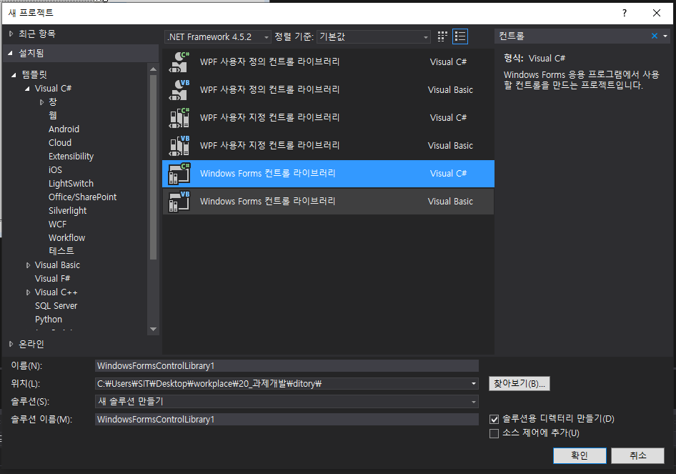
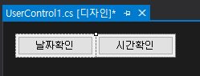
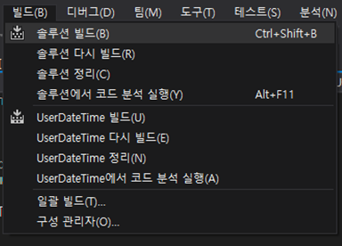
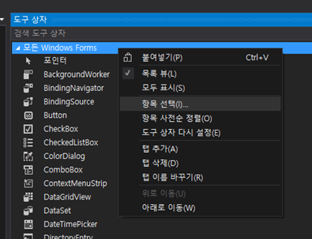
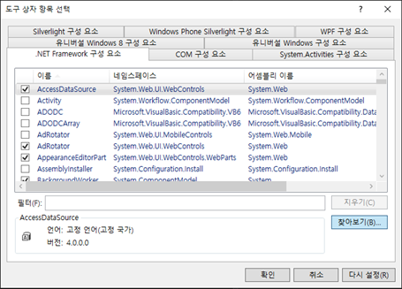
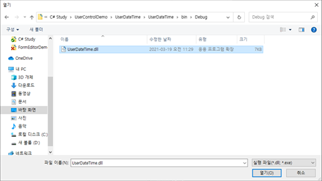
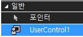
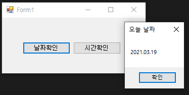

## C# WinForm Study06 - UserControl

#### UserControl(사용자 정의 컨트롤)?

>WinForm에서는 기존에 제공하는 Control을 조합해서 새로운 사용자 정의 컨트롤을 만들 수 있음
>
>다른 프로젝트에서 재사용이 가능하기 때문에 효율성, 생산성 향상

#### UserControl 생성

>**1) Visual Studio에서  <u>*새 프로젝트 -> Windows Forms 컨트롤 라이브러리*</u>  프로젝트 생성**
>
>
>
>
>
>**2) 원하는 형태의 컨트롤 배치 및 속성 값 설정**
>
>
>
>| **폼 컨트롤**    | **속성**  | **값**            |
>| ---------------- | --------- | ----------------- |
>| UserControl      | Name      | UserControl1      |
>| Size             | 200, 30   |                   |
>| TableLayoutPanel | Name      | tableLayoutPanel1 |
>| Dock             | Fill      |                   |
>| ColumnCount      | 2         |                   |
>| RowCount         | 1         |                   |
>| Button           | Name      | btnDate           |
>| Dock             | Fill      |                   |
>| Text             | 날짜 확인 |                   |
>| Button           | Name      | btnTime           |
>| Dock             | Fill      |                   |
>| Text             | 시간 확인 |                   |
>
>
>
>**3) 이벤트 등록**
>
>    namespace UserDateTime
>     {
>           public partial class UserControl1: UserControl
>           {
>               public UserControl1()
>               {
>                   InitializeComponent();
>               }
>              private void btnDate_Click(object sender, EventArgs e)
>               {
>                   string date = DateTime.Now.ToString("yyyy.MM.dd");
>                   MessageBox.Show(date, "오늘 날짜");
>               }
>                      private void btnTime_Click(object sender, EventArgs e)
>           	  {
>               string time = DateTime.Now.ToString("HH:mm:ss");
>               MessageBox.Show(time, "현재 시간");
>              }
>          }
>    }
>
>
>**4) <u>빌드 -> 솔루션 빌드</u>를 클릭하여 프로젝트 빌드**
>
>- 프로젝트 폴더\bin\Debug 폴더에 **UserDateTime.dll** 파일이 생성
>- 생성된 **UserDateTime.dll** 파일을 참조하면 다른 프로젝트에서 사용자 정의 컨트롤을 사용 가능
>
>
>
>

#### UserControl 사용

>**1) UserControl을 사용하고 싶은 Project의 <u>도구 상자 우클릭 후 항목 선택</u> 클릭**
>
>
>
>
>
>**2) 도구상자 항목 선택에서 찾아보기 클릭**
>
>
>
>
>
>**3) 빌드후 생성된 UserDateTime.dll 파일을 연 후 확인**
>
>- 만약 “*<u>도구 상자에 놓을 수 있는 구성 요소가 없습니다</u>*.” 라는 오류가 발생할 경우 UserDateTime.dll 파일을 도구 상자에 드래그 앤 드롭하면 사용자 정의 컨트롤이 생성
>
>
>
>
>
>**4) 프로젝트에 배치하여 확인**
>
> 
>
>

참고 사이트

- https://ssabi.tistory.com/40 [싸비]

