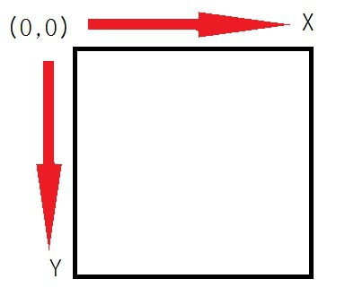
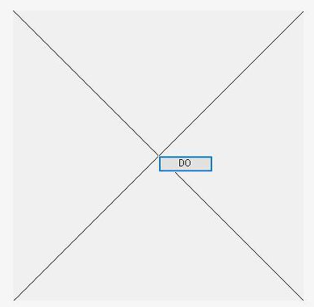
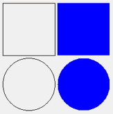

## C# WinForm Study07 - Graphic(그리기 도구)

#### Graphics란?

> Form에 그림을 그리기 위한 클래스


#### 컴퓨터 좌표계

>


#### 선 그리기

>**1) Graphics개체에 대한 참조**
>
>```
>Graphics graphics = CreateGraphics();
>```
>
>
>
>**2) 선의 굵기와 색 정하기**
>
>```
>//System.Drawing.Pen에 있는 Pen 클래스를 사용.
>Pen name = new Pen(color,width); //color : 선의 색 , width : 선의 굵기
>Pen name = new Pen(color); // width은 1
>```
>
>
>
>**3) 시작점과 끝점 정하기**
>
>```
>//System.Drawing.Graphics에 있는 DrawLine함수를 사.
>//pen : Pen클래스로 정한 선의 색과 굵기.
>//x1,y1 : 시작점.
>//x2,y2 : 끝점.
>DrawLine(pen, x1, y1, x2, y2);
>```
>
>
>
>**4) Graphics 객체 해제 **
>
>```
>graphics.Dispose();
>```
>
>
>
>**예제**
>
>버튼 클릭 시  대각선 그리기
>
>
>
>```
>namespace WindowsFormsApplication3
>{
>public partial class Fk : Form
>{
>   public Fk()
>   {
>       InitializeComponent();
>       this.Size = new Size(400, 400);
>
>
>   }
>   private void button1_Click(object sender, EventArgs e)
>   {
>       Graphics graphics = CreateGraphics();
>       Pen pen = new Pen(Color.Black);
>       graphics.DrawLine(pen,0,0,400,400);
>       graphics.DrawLine(pen,0,400,400,0);
>
>       graphics.Dispose();
>   }
>}
>}
>```


#### 도형 그리기

>
>
>```
>//직사각형 그리기
>e.Graphics.DrawRectangle(pen, new Rectangle(0, 0, 100, 100));
>
>//내부 색을 채워 직사각형 그리기
>e.Graphics.FillRectangle(new SolidBrush(Color.Blue), 
>						 new Rectangle(105, 0, 100, 100));
>
>//타원 그리기
>e.Graphics.DrawEllipse(pen, new Rectangle(0, 105, 100, 100));
>
>// 내부 색을 채워 타원 그리기
>e.Graphics.FillEllipse(new SolidBrush(Color.Blue), 
>					   new Rectangle(105, 105, 100, 100));
>```
>
>- new Rectangle(시작 X, 시작 Y, 사각형 폭, 사각형 높이);
>- new SolidBrush(Color.Blue); 